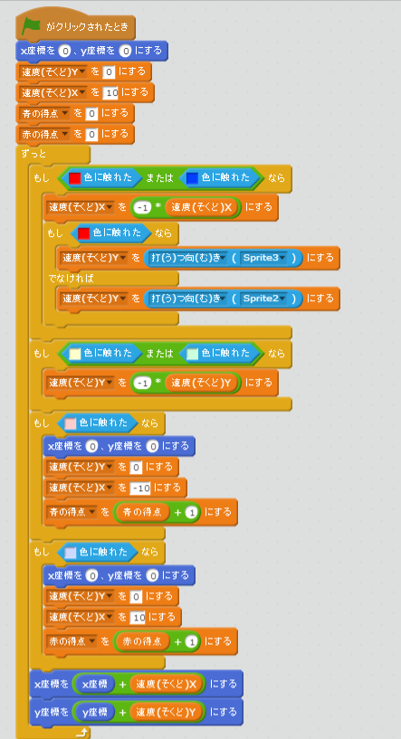

# ボールが跳(は)ね返(かえ)る角度(かくど)を変(か)える
https://scratch.mit.edu/projects/78437120/#player

上下(じょうげ)に移動(いどう)する操作(そうさ)に応(おう)じて、ボールが跳(は)ね返(かえ)る向(む)きを調整(ちょうせい)する機能(きのう)を追加(ついか)します

#### (1) 青色(あおいろ)のラケットに、移動(いどうした)したタイミングに応(おう)じて打(う)つ向(む)きを決(き)める
##### (1-1) 下記(かき)スクリプトを追加(ついか)してください

**※ 「打(う)つ向(む)き」変数(へんすう)を作(つく)るときは、「このSpriteのみ」にチェックを入れてください**

#### (2) 赤色のラケットに、移動したタイミングに応じて打つ向きを決める
##### (2-1) 下記スクリプトを追加してください

#### (3) ラケット記録したをもとに、ボールが跳ね返る向きを決める
##### (3-1) 下記スクリプトを追加してください

#### (4) 確認しよう
https://scratch.mit.edu/projects/78437120/#player

##### (4-1) ボールがラケットに当たる瞬間にラケットを移動すると移動した向きに、ボールが移動すること
