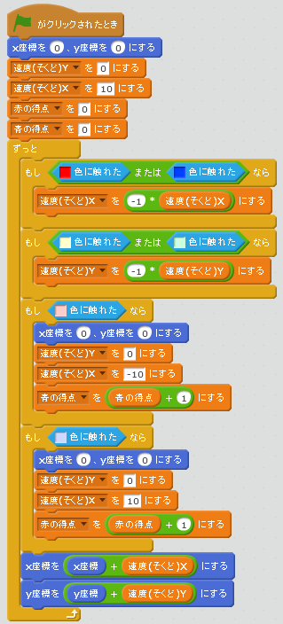

# 勝ち負けを判定する

勝(か)ち負(ま)けを判定(はんてい)できるようにしましょう。

 
 
 

### (1) 勝(か)ち負(ま)けを判定(はんてい)するスクリプトを追加(ついか)
##### (1-1) ボールSpriteに以下(いか)のスクリプトを追加(ついか)してください

**※ 「Yの速度(そくど)」変数(へんすう)を作(つく)るときは、「このSpriteのみ」にチェックを入れてください**

**※ 「Xの速度(そくど)」変数(へんすう)を作(つく)るときは、「このSpriteのみ」にチェックを入れてください**

**※ 「赤の得点」変数(へんすう)を作(つく)るときは、「すべてのSpriteよう」にチェックを入れてください**

**※ 「青の得点」変数(へんすう)を作(つく)るときは、「すべてのSpriteよう」にチェックを入れてください**

 
 
 

### (2) 確認(かくにん)してみよう
https://scratch.mit.edu/projects/78435366/

##### (2-1) ボールが左右に壁にぶつかると、得点表示が更新されます。

 
 
 

### (3) Good!

