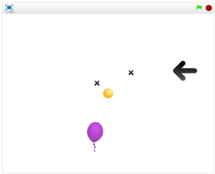

# 的を作る

https://scratch.mit.edu/projects/78602454/

#### (1) 的を追加する

##### (1-1) 左下のキャラクターアイコンをクリックする

##### (1-2)「もの」をクリック
##### (1-3)「Balloon」をクリック
##### (1-4) 右下のOKをクリック

#### (2) 的を表示するスクリプトを追加する

##### (2-1) 左下(ひだりした)のBalloonをクリックする
##### (2-2) 右上(みぎのうえ)のスクリプトタブをクリック
##### (2-3) 下記(かき)スクリプトを追加(ついか)してください

#### (3) 確認してみよう
https://scratch.mit.edu/projects/78602454/

##### (3-1) 右上(むぎうえ)の緑色(みどりいろ)の旗(はた)をクリックしてください。
##### (3-2) aキーを押すと機雷が発射されることを確認してください
##### (3-3) 魚雷が的に当たると、的が消えることを確認してください

