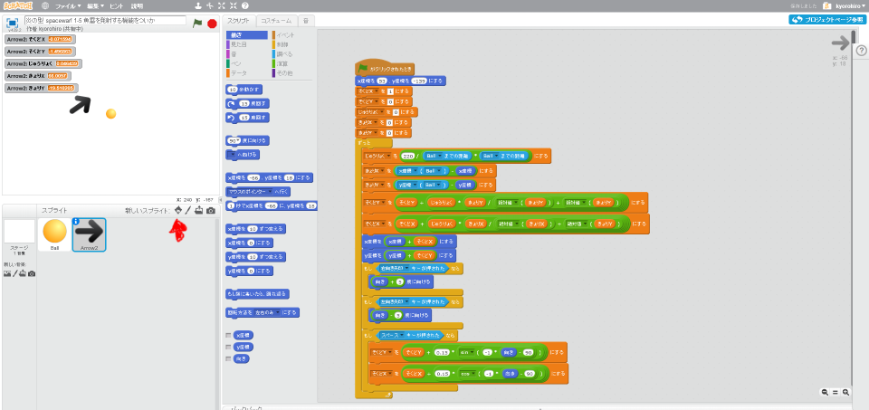
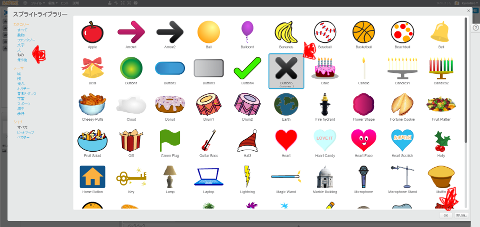
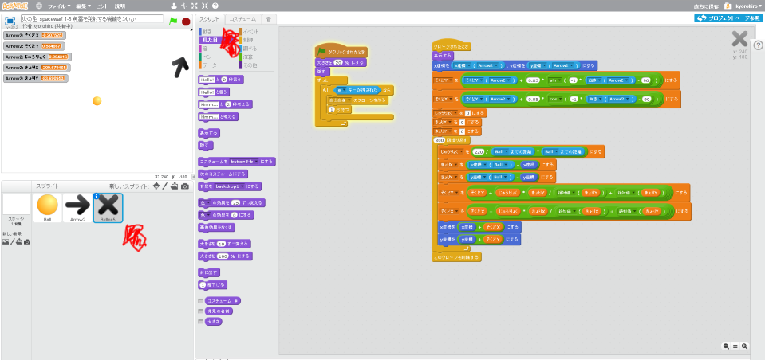
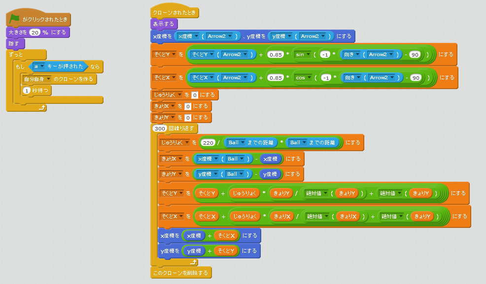
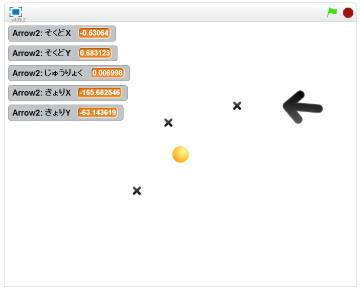

# 機雷発射機能を作る
https://scratch.mit.edu/projects/78601124/#player

#### (1) 機雷を追加する

##### (1-1) 左下のキャラクターアイコンをクリックする

##### (1-2)「もの」をクリック
##### (1-3)「Button5」をクリック
##### (1-4) 右下のOKをクリック

#### (2) 魚雷を発射するスクリプトを追加する

##### (2-1) 左下(ひだりした)のButton5をクリックする
##### (2-2) 右上(みぎのうえ)のスクリプトタブをクリック
##### (2-3) 下記(かき)スクリプトを追加(ついか)してください

#### (3) 確認してみよう
https://scratch.mit.edu/projects/78601124/#player

##### (3-1) 右上(むぎうえ)の緑色(みどりいろ)の旗(はた)をクリックしてください。
##### (3-2) aキーを押すと機雷が発射されることを確認してください
