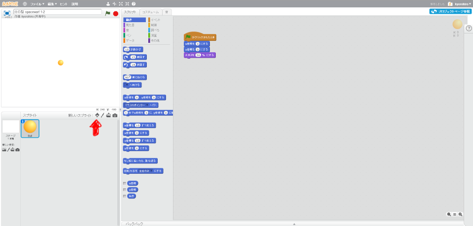
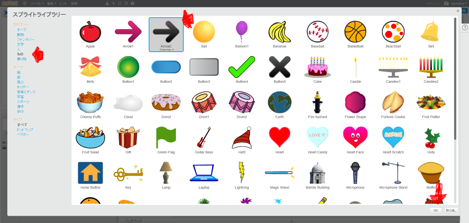
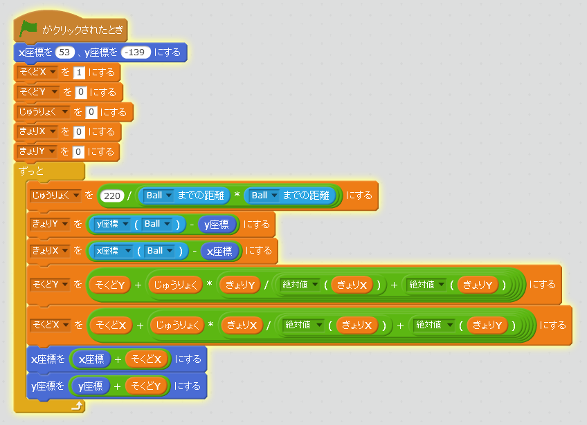

# ロケットと重力を追加
https://scratch.mit.edu/projects/78596462/

#### (1) ロケットを追加する

##### (1-1) 左下のキャラクターアイコンをクリックする

##### (1-2)「もの」をクリック
##### (1-3)「Arrow」をクリック
##### (1-4) 右下のOKをクリック

#### (2)重力を追加する

