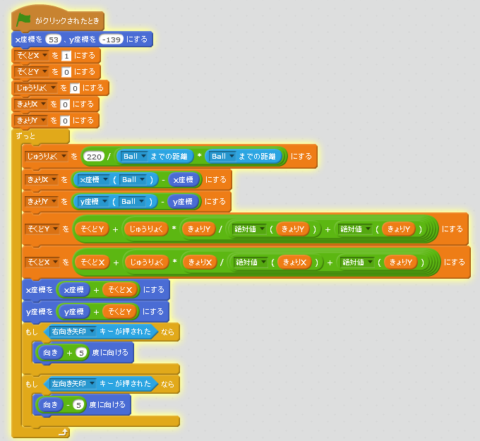

# 旋回機能を追加
https://scratch.mit.edu/projects/78600004/

#### (1) 旋回するスクリプトを追加する
##### (1-1) 左下(ひだりした)のArrowをクリックする
##### (1-2) 右上(みぎのうえ)のスクリプトタブをクリック
##### (1-3) 下記(かき)スクリプトを追加(ついか)してください

#### (2) 確認してみよう
https://scratch.mit.edu/projects/78596462/

##### (2-1) 右上(むぎうえ)の緑色(みどりいろ)の旗(はた)をクリックしてください。
##### (2-2) 左キーを押したら左に旋回すること
##### (2-3) 右キーを押したら右に旋回すること
