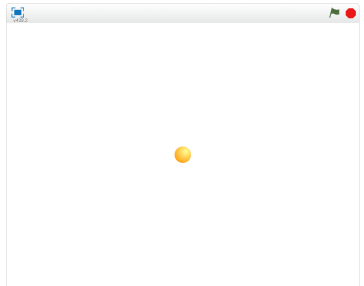

# 太陽(たいよう)を追加(ついか)する
https://scratch.mit.edu/projects/78594872/

#### (1) ボールを追加(ついか)する

##### (1-1) 左下(ひだりした)のキャラクターアイコンをクリックする

##### (1-2)「もの」をクリック
##### (1-3)「Ball」をクリック
##### (1-4) 右下(みぎした)のOKをクリック

#### (2) Sprite1 を削除(さくじょ)する
猫(ねこ)のSprite(スプライト)は使(つか)わないので削除(さくじょ)しましょう。 

##### (2-1) Sprite1の上(うえ)にマウスカーソルを合(あ)わせる

##### (2-2) 右(みぎ)クリックする

##### (2-3) メニューから削除(さくじょ)を選(えら)ぶ

#### (3) 太陽(たいよう)を中央(ちゅうお)に固定(こてい)する

##### (3-1) 左下(ひだりした)のBallをクリックする
##### (3-2) 右上(みぎのうえ)のスクリプトタブをクリック

##### (3-3) 下記(かき)スクリプトを追加(ついか)してください

#### (4) 確認(かくにん)してみよう
https://scratch.mit.edu/projects/78594872/

##### (4-1) 右上(むぎうえ)の緑色(みどりいろ)の旗(はた)をクリックしてください。ボールが中央(ちゅうおう)に表示(ひょうじ)されます

