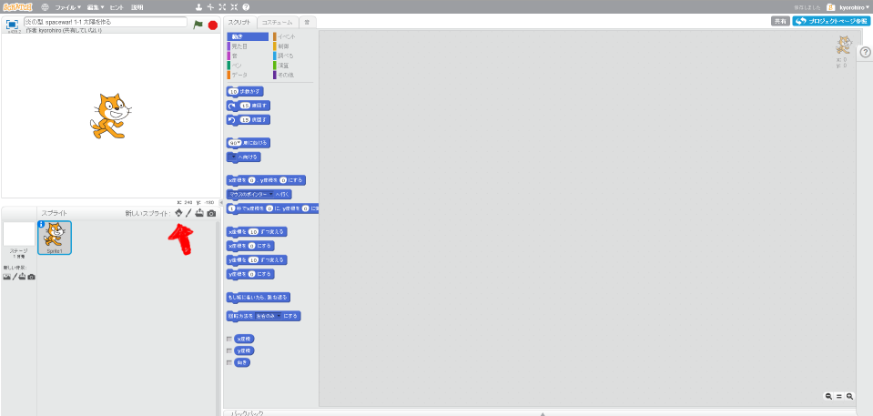
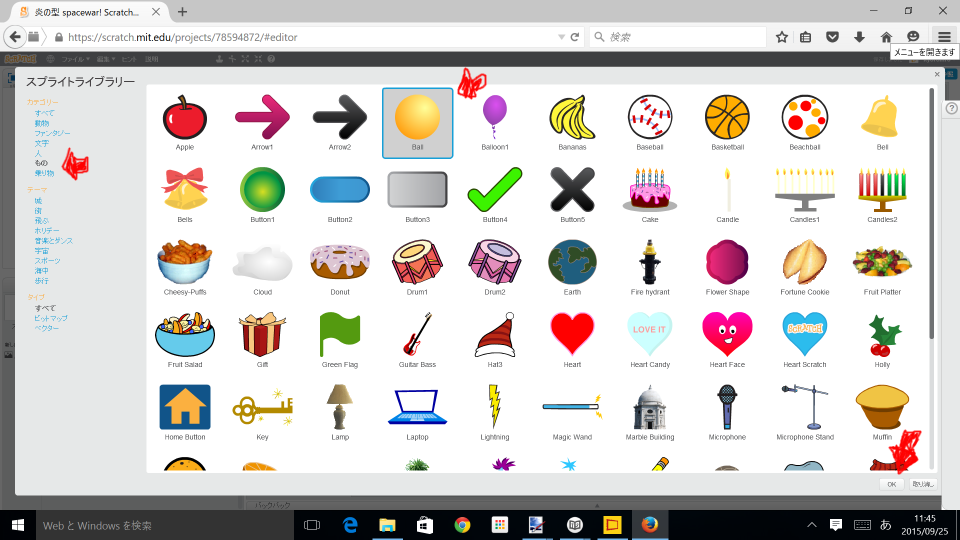
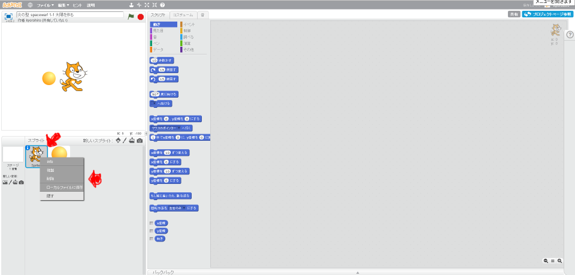
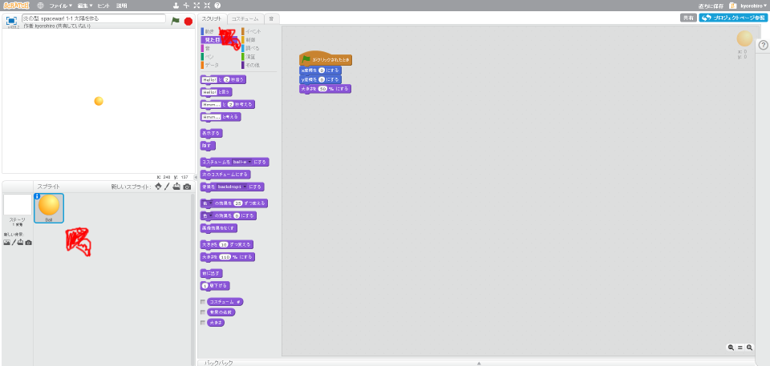
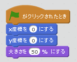

# 太陽を追加する
https://scratch.mit.edu/projects/78594872/

#### (1) ボールを追加する

##### (1-1) 左下のキャラクターアイコンをクリックする

##### (1-2)「もの」をクリック
##### (1-3)「Ball」をクリック
##### (1-4) 右下のOKをクリック

#### (2) Sprite1 を削除(さくじょ)する
猫(ねこ)のSprite(スプライト)は使(つか)わないので削除(さくじょ)しましょう。 

##### (2-1) Sprite1の上にマウスカーソルを合わせる

##### (2-2) 右(みぎ)クリックする

##### (2-3) メニューから削除(さくじょ)を選(えら)ぶ

#### (3) 太陽を中央に固定する

##### (3-1) 左下(ひだりした)のBallをクリックする
##### (3-2) 右上(みぎのうえ)のスクリプトタブをクリック

##### (3-3) 下記(かき)スクリプトを追加(ついか)してください

#### (4) 確認してみよう
https://scratch.mit.edu/projects/78594872/

##### (2-1) 右上(むぎうえ)の緑色(みどりいろ)の旗(はた)をクリックしてください。ボールが中央に表示されます

