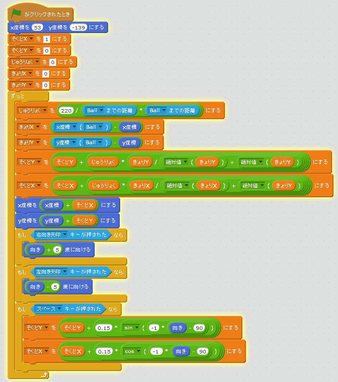
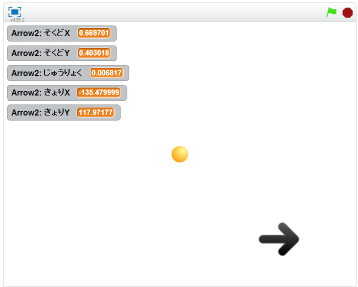

# 推進機能(すいしん)を作(つく)る

https://scratch.mit.edu/projects/78600562/

#### (1)推進機能(すいしんきのう)を追加(ついか)する
##### (1-1) 左下(ひだりした)のArrowをクリックする
##### (1-2) 右上(みぎのうえ)のスクリプトタブをクリック
##### (1-3) 下記(かき)スクリプトを追加(ついか)してください

**※ 「そくどX」変数(へんすう)を作(つく)るときは、「このSpriteのみ」にチェックを入れてください**

**※ 「そくどY」変数(へんすう)を作(つく)るときは、「このSpriteのみ」にチェックを入れてください**

**※ 「じゅうりょく」変数(へんすう)を作(つく)るときは、「このSpriteのみ」にチェックを入れてください**

**※ 「きょりX」変数(へんすう)を作(つく)るときは、「このSpriteのみ」にチェックを入れてください**

**※ 「きょりY」変数(へんすう)を作(つく)るときは、「このSpriteのみ」にチェックを入れてください**

#### (2) 確認(かくにん)してみよう
https://scratch.mit.edu/projects/78600562/

##### (2-1) 右上(むぎうえ)の緑色(みどりいろ)の旗(はた)をクリックしてください。
##### (2-2) Spaceキーを押すと、ロケットが前進することを確認してください

