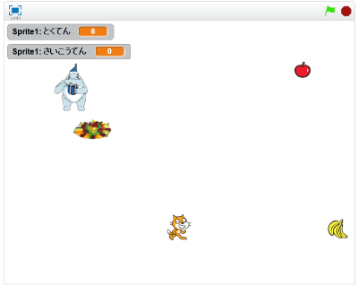

# おにごっこ

おにごっこをテーマにして、ゲームを作(つく)ってみましょう。

おにごっことは何(なん)でしょうか。どのようなゲームでしょうか。

* 鬼(おに)から逃(に)げるゲーム
* 走(はし)る
* かわす

あなたが考える「おにごっこ」を2Dゲームとして、再現(さいげん)してみましょう!!

# 見本(みほん)

https://scratch.mit.edu/projects/87798109/

