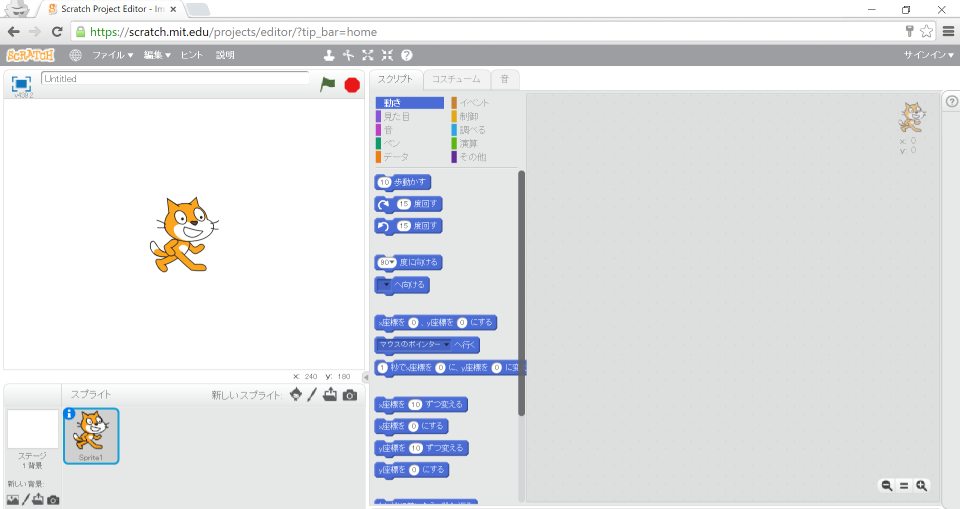
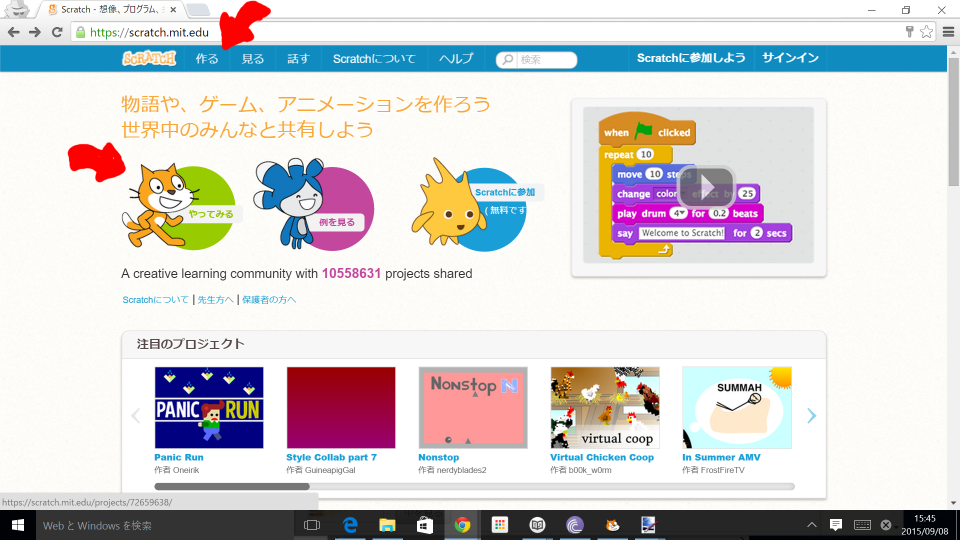

# プロジェクトを作成(さくせい)しよう

いつも通り、プロジェクトを作成(さくせい)するところから、始(はじ)めてみましょう!!

この画面(がめん)を表示(ひょうじ)できていますでしょうか。

では、一緒(いっしょ)にこの画面(がめん)を表示(ひょうじ)するまでをやってみましょう!!

 
 

#### [1] Scratchのページにアクセスする
https://scratch.mit.edu/

 
 

#### [2] 「作る」または、「やってみる」クリックする

ゲーム開発画面(かいはつがめん)が表示(ひょうじ)されます。

 
 
