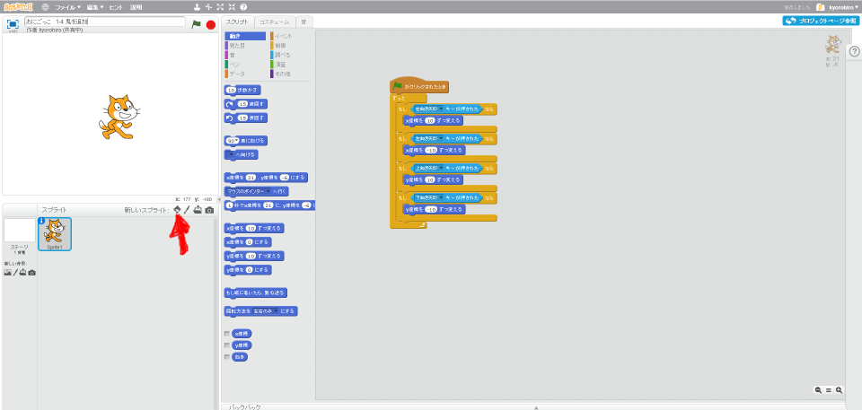
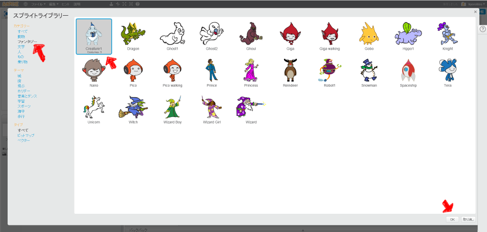
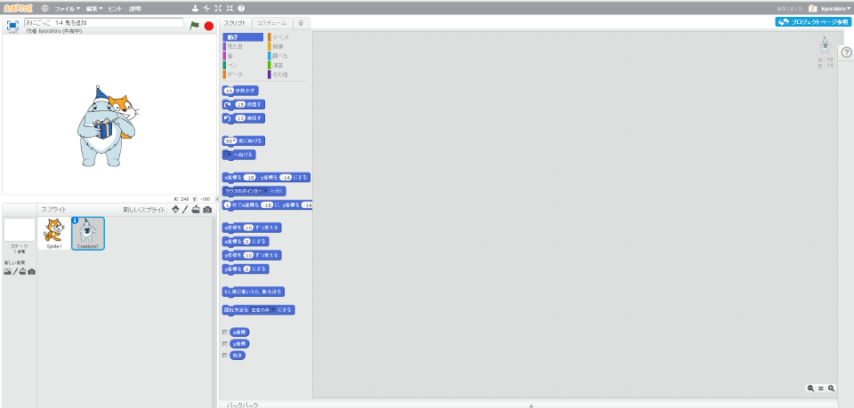

# 鬼(おに)を作成(さくせい)する

鬼(おに)を追加(ついか)してみましょう。

 
 

### (1) Spriteを追加()ついかする

##### (1-1) 左下(ひだりした)のキャラクタアイコンをクリックする
 
 

##### (1-2) お好(この)みの画像(がぞう)を選択(せんたく)して、OKボタンを押(お)してください。
 
 

 
 

### (2) Good!!

よくできました。次(つぎ)のステップに進(すす)みましょう。
