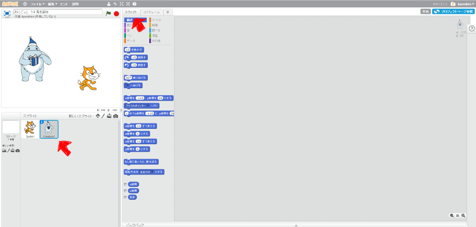
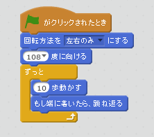
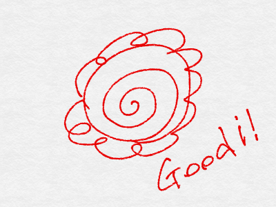

# 鬼を作成する。 (2)

鬼に追いかける機能を追加してみましょう。

 
 

### (1) スクリプト画面を表示する

##### (1-1) 左下のキャラクタアイコンをクリックする
##### (1-2) スクリプトタブをクリックする

 
 
### スクリプトを追加する

 
 
### (2) 確認する
https://scratch.mit.edu/projects/87785015/

##### (2-1) 右上の旗をクリックする
##### (2-2) 追加した鬼が画面を動き回ること

 
 

### (3) Good!!

よくできました。次(つぎ)のステップに進(すす)みましょう。

 
 