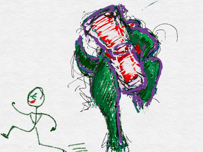
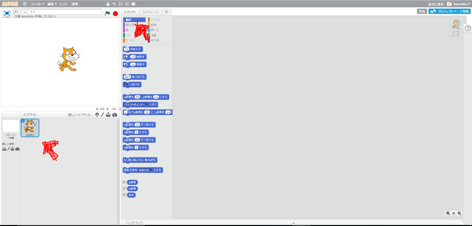
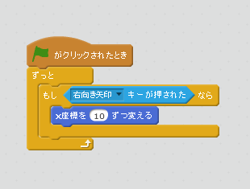
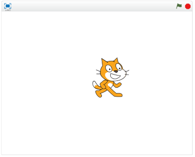

# 鬼から逃げる

鬼から逃げる機能を作成してみましょう。

まずは、右キーを押したら、右に移動する機能を追加してみます。

### (1) Sprite1のスクリプト画面を表示する

##### (1-1) 左下のSprite1をクリックする
##### (1-2) スクリプトタブをクリックする

 
 

### (2) スクリプトを追加する。

 
 

### (3) 確認する

##### (3-1) 右上の旗をクリックする
##### (3-2) 右キーを押すと右に移動すること

 
 
### (4) Good!

よくできました。次(つぎ)のステップに進(すす)みましょう

