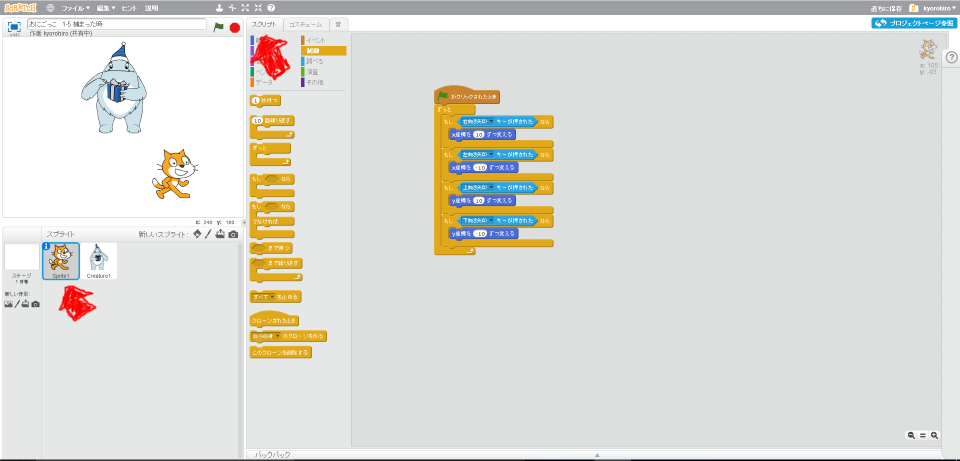
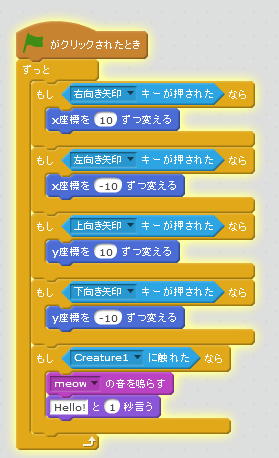
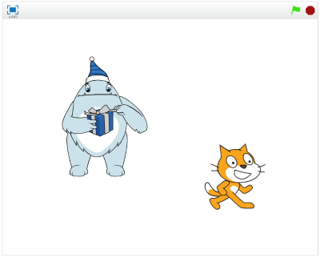

# 捕(つか)まった時(とき)の動作(どうさ)

### (1) Sprite1のスクリプト画面(がめん)を表示(ひょうじ)する

##### (1-1) Sprite1をクリック
##### (1-2) スクリプトタブをクリック
 
 

### (2) Sprite1にスクリプトを追加(ついか)する

 
 
### (3) 確認(かくにん)する

##### (3-1) 右上(みぎうえ)の旗(はた)をクリックする
##### (3-2) 鬼(おに)とぶつかるとSprite1が"アウチ!!"ということ

 
 

### (4) Good!!

https://scratch.mit.edu/projects/87788048/#player

よくできました。次(つぎ)のステップに進(すす)みましょう。

 
 