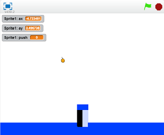

# Tennis for two (テニス　フォー　ツー)

「Tennis for two」は世界(せかい)で初(はじ)めて、
一般(いっぱん)の人(ひと)向(む)けに作成(さくせい)された
ビデオゲームと言(い)われています。
このゲームは、1958年(ねん)に公開(こうかい)されました。

アメリカの物理学者(ぶつりがくしゃ)である、William Higinbotham(ウィリアム・ヒギンボーサム)によって作成(さくせい)されました。Brookhaven National Laboratory(ブルックヘブンこくりつ国立研究所(こくりつけんきゅうじょ))の来訪者(らいほうしゃ)向(む)けに作成(さくせい)されたものです。

オシロスコープとアナログ回路(カイロ)を用(もち)いて作成(さくせい)されたものです。当時(とうじ)のデジタルコンピュータには、パンチカードでプログラムを書(か)き、プリンターで結果(けっか)を出力(しゅつりょく)していました。当時(とうじ)のデジタルコンピュータは、ビデオゲームを動(うご)かすような能力(のうりょく)は持(も)っていなかったのです。

## Tennis for two
https://youtu.be/u6mu5B-YZU8

オシロスコープにテニスコートが表示されており。コントローラを操作してボールを打つことができた。

コントローラには、二つの操作機器がついていて、図のAの部分を回して角度をきめて、図のBの部分を押すことでボールを弾くことができた。

勝敗の判定はコンピュータは行いません。ゲームをプレーした人が判定します。

## Scratchで作成してみよう
https://scratch.mit.edu/projects/77983448/

次の章から、作成していきます。マウスで角度を調節して、Spaceキーでボールを打ちます。一人用です。

## 用語
* オシロスコープ
電位差(でんいさ)を2次元(じげん)グラフとそと表示する装置(そうち)

## ref
https://www.bnl.gov/about/history/firstvideo.php
http://www.cbc.ca/news/technology/video-games-turn-50-1.703624
https://ja.wikipedia.org/wiki/Tennis_for_Two
http://gamersbox.net/pages/history_of_video_game/
http://www.nicovideo.jp/watch/sm10824956
https://www.bnl.gov/about/history/

