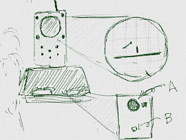

# Tennis for two (テニス　フォー　ツー)

「Tennis for two」は世界(せかい)で初(はじ)めて、
一般(いっぱん)の人(ひと)向(む)けに作成(さくせい)された
ビデオゲームと言(い)われています。
このゲームは、1958年(ねん)に公開(こうかい)されました。

アメリカの物理学者(ぶつりがくしゃ)である、William Higinbotham(ウィリアム・ヒギンボーサム)によって作成(さくせい)されました。Brookhaven National Laboratory(ブルックヘブンこくりつ国立研究所(こくりつけんきゅうじょ))の来訪者(らいほうしゃ)向(む)けに作成(さくせい)されたものです。

オシロスコープとアナログ回路(カイロ)を用(もち)いて作成(さくせい)されました。
デジタルなプログラムで作成(さくせい)されなかったのは、当時(とうじ)のデジタルコンピュータには、パンチカードでプログラムを書(か)き、プリンターで結果(けっか)を出力(しゅつりょく)していました。当時(とうじ)のデジタルコンピュータは、ビデオゲームを動(うご)かすような能力(のうりょく)は持(も)っていなかったからです。

## Tennis for two
https://youtu.be/u6mu5B-YZU8

オシロスコープにテニスコートが表示されており。コントローラを操作(そうさ)してボールを打(う)つことができた。

コントローラには、二つの操作機器(そうさきき)がついていて、図(ず)のAの部分(ぶぶん)を回(まわ)して角度(かくど)をきめて、図(ず)のBの部分(ぶぶん)を押(お)すことでボールを弾(はじ)くことができた。

このゲームでは勝敗(しょうはい)の判定(はんてい)はコンピュータは行(おこな)いません。ゲームをプレーした人(ひと)が判定(はんてい)します。

## Scratchで作成(さくせい)してみよう
https://scratch.mit.edu/projects/77983448/

次(つぎ)の章(しょう)から、作成(さくせい)していきます。マウスで角度(かくど)を調節(ちょうせい)して、Spaceキーでボールを打(う)ちます。一人用(ひとりよう)です。

## 用語(ようご)
* オシロスコープ
電位差(でんいさ)を2次元(じげん)グラフに表示(ひょうじ)する装置(そうち)

## ref
* https://www.bnl.gov/about/history/firstvideo.php
* http://www.cbc.ca/news/technology/video-games-turn-50-1.703624
* https://ja.wikipedia.org/wiki/Tennis_for_Two
* http://gamersbox.net/pages/history_of_video_game/
* http://www.nicovideo.jp/watch/sm10824956

