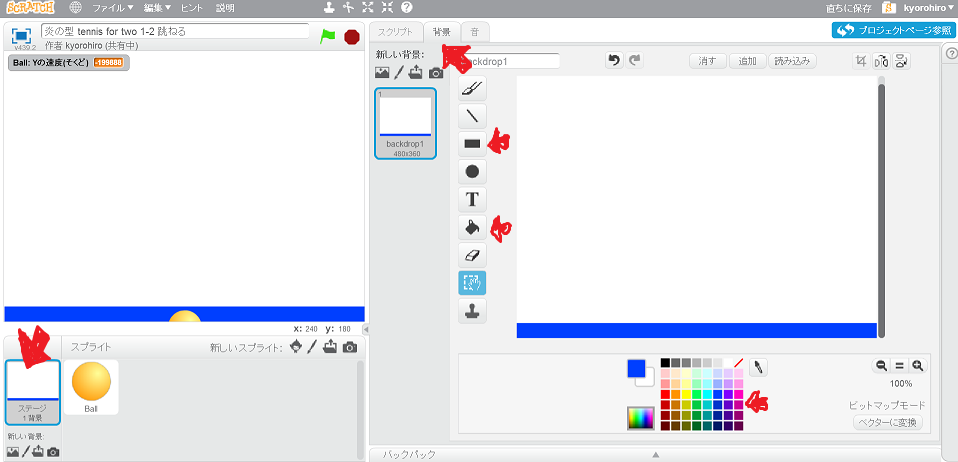
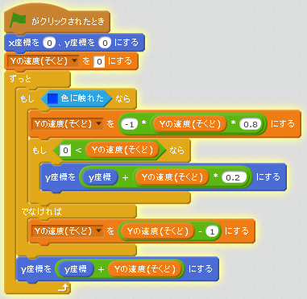
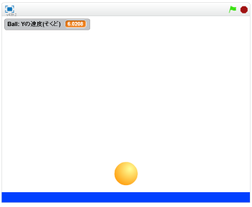

# 跳ねる
https://scratch.mit.edu/projects/78270956/

大地を追加して、地面に衝突したボールを跳ねさせよう

#### (1) 背景に地面を描く

##### (1-1) 左下の「ステージ1背景」をクリックする
##### (1-2) 右上の背景タブをクリックする
##### (1-3) 上図のように地面を書く。単色で描いてください

#### (2) 衝突したボールが跳ねるスクリプトを追加する

##### (2-1) 左下(ひだりした)のBallをクリックする

##### (2-2) 右上(みぎのうえ)のスクリプトタブをクリック

##### (2-3) 上記(じょうき)スクリプトを追加(ついか)してください

#### (3) 確認してみる
https://scratch.mit.edu/projects/78270956/

##### (3-1) 右上の緑色の旗をクリックする。地面に衝突すると跳ね返ることを確認する。
