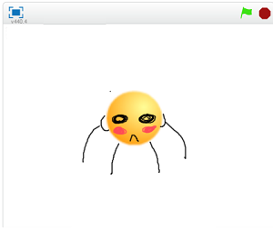

# ボールを追加(ついか)する

まずは、ボールを追加してみましょう。

#### (1) ボールを追加(ついか)する 

##### (1-1) 左下(ひだりした)のキャラクターアイコンをクリックする

##### (1-2)「もの」をクリック
##### (1-3)「Ball」をクリック
##### (1-4) 右下(みぎした)のOKをクリック

#### (2) Sprite1 を削除(さくじょ)する
猫(ねこ)のSprite(スプライト)は使(つか)わないので削除(さくじょ)しましょう。 

##### (2-1) Sprite1の上にマウスカーソルを合わせる

##### (2-2) 右(みぎ)クリックする

##### (2-3) メニューから削除(さくじょ)を選(えら)ぶ

