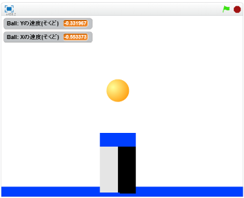

# Coatを作成(さくせい)する
https://scratch.mit.edu/projects/78314736/

#### (1) 背景(はいけい)にコートを描(か)く

##### (1-1) 左下(ひだりした)の「ステージ1背景」をクリックする
##### (1-2) 右上(みぎうえ)の背景(はいけい)タブをクリックする
##### (1-3) 上図(じょうず)のように絵(え)を描(か)く。3色(じょく)で描(か)いてください

　
　　
#### (2) 衝突したボールが跳ねるスクリプトを追加する

##### (2-1) 左下(ひだりした)のBallをクリックする

##### (2-2) 右上(みぎのうえ)のスクリプトタブをクリック

##### (2-3) 下記(かき)スクリプトを追加(ついか)してください

　
　
　
#### (3) 確認する
https://scratch.mit.edu/projects/78314736/

##### (3-1) 右上の緑色の旗をクリックする。
##### (3-2) Spaceボタンを押すと、マウスカーソルで指定した方向にボールが飛んでいくのを確認する。
##### (3-3) コートに触れると跳ね返ることを確認する

