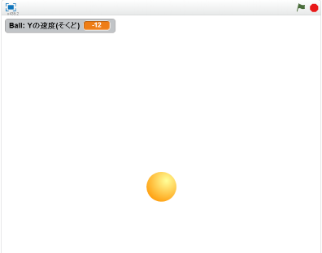

# 自由落下(じゆうらっか)させる
https://scratch.mit.edu/projects/78216824/

自由落下(じゆうらっか)のスクリプトを追加(ついか)しましょう。

#### (1) ボールにスクリプトを追加(ついか)する

##### (1-1) 左下(ひだりした)のBallをクリックする
##### (1-2) 右上(みぎのうえ)のスクリプトタブをクリック

##### (1-3) 下記(かき)スクリプトを追加(ついか)してください

**※ 「Yの速度(そくど)」変数を作るときは、「このSpriteのみ」にチェックを入れてください**

#### (2) 確認してみよう
https://scratch.mit.edu/projects/78216824/

##### (2-1) 右上(むぎうえ)の緑色(みどりいろ)の旗(はた)をクリックしてください。ボールが落下します。

