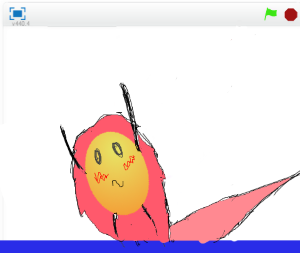

# 左右(さゆう)へ移動(いどう)する

今(いま)までに作成(さくせい)したプログラムが、上下(じょうげ)の移動(いどう)だけしかできませんでした。

左右(さゆう)にも移動(いどう)できるようにしましょう!!

 
 
 
### (1) 左右(さゆう)へも移動(いどう)できるようにする
##### (1-1) 左下(ひだりした)のBallをクリックする
##### (1-2) 右上(みぎのうえ)のスクリプトタブをクリック
##### (1-3) 下記(かき)スクリプトを追加(ついか)してください

**※ 「Yの速度(そくど)」変数(へんすう)を作るときは、「このSpriteのみ」にチェックを入れてください**
**※ 「Xの速度(そくど)」変数(へんすう)を作るときは、「このSpriteのみ」にチェックを入れてください**

 
 
 

### (2) 確認(かくにん)する
https://scratch.mit.edu/projects/78304898/

##### (2-1) 右上(みぎうえ)の緑色(みどりいろ)の旗(はた)をクリックする。地面(じめん)に衝突(しょうとつ)すると跳(は)ね返(かえ)ることを確認(かくにん)する。

 
 
 

### (3) Good!

良(よ)くできました。次(つぎ)のステップに進(すすみ)みましょう!!
