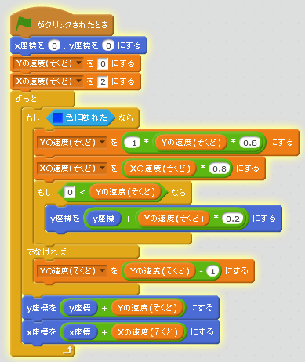
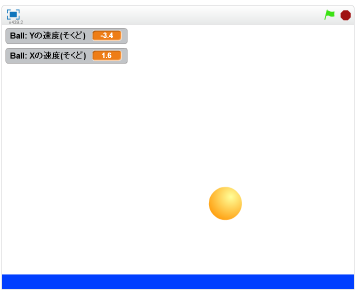

# 左右(さゆう)へ移動(いどう)する

#### (1) 左右(さゆう)へも移動(いどう)できるようにする
##### (1-1) 左下(ひだりした)のBallをクリックする
##### (1-2) 右上(みぎのうえ)のスクリプトタブをクリック
##### (1-3) 下記(かき)スクリプトを追加(ついか)してください

#### (2) 確認(かくにん)する
https://scratch.mit.edu/projects/78304898/

##### (2-1) 右上(みぎうえ)の緑色(みどりいろ)の旗(はた)をクリックする。地面(じめん)に衝突(しょうとつ)すると跳(は)ね返(かえ)ることを確認(かくにん)する。
