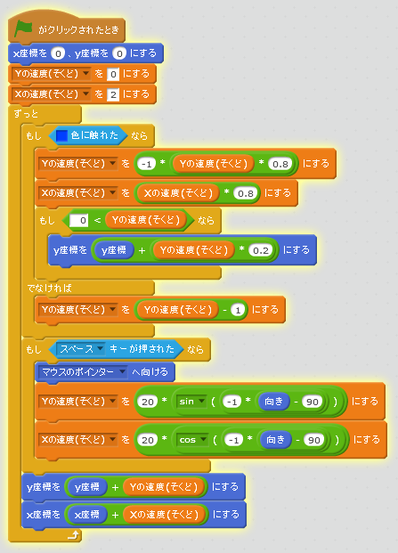

# ボールを打(う)つ

#### (1) ラケットでボールを打(う)てるようにする
##### (1-1) 左下(ひだりした)のBallをクリックする
##### (1-2) 右上(みぎのうえ)のスクリプトタブをクリック
##### (1-3) 下記(かき)スクリプトを追加(ついか)してください

**※ 「Yの速度(そくど)」変数(へんすう)を作(つく)るときは、「このSpriteのみ」にチェックを入れてください**
**※ 「Xの速度(そくど)」変数(へんすう)を作(つく)るときは、「このSpriteのみ」にチェックを入れてください**

#### (2) 確認(かくにん)する
https://scratch.mit.edu/projects/78309820/

##### (2-1) 右上(みぎうえ)の緑色(みどりいろ)の旗(はた)をクリックする。
##### (2-2) Spaceボタンを押(お)すと、マウスカーソルで指定(してい)した方向(ほうこう)にボールが飛(と)んでいくのを確認(かくにん)する。

