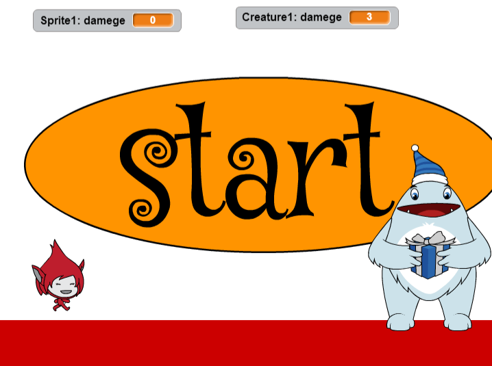

# 基礎鍛錬のゴール

この章では、モンスターとの対戦ゲームを作成します。

モンスターが投げるボールをよけながら、ビームをあてるゲームです。
このゲームの作成を通して、「数学」、「物理学」について学習していきましょう。

このゲームは以下のサイトで遊ぶことができます。
https://scratch.mit.edu/projects/75433800/

* 算数/数学
 * 足し算
 * 引き算
 * x座標とy座標
 * 0から200までの数字
 * 0から-200までの数字
* 物理学
 * 加速度
* プログラム
 * While文
 * if文
 * 変数
 * イベント文
 * 衝突判定

* [基礎鍛錬のゴール](test/b001/About.md)
  * [基礎鍛錬(きそたんれん) 移動の型]
    * [開発画面を表示する](test/b001/CreateProject.md)
    * [右(みぎ)に移動(いどう)](test/b001/MoveRight.md)
    * [左(ひだり)に移動(いどう)](test/b001/MoveLeft.md)
    * [上(うえ)に移動(いどう)](test/b001/MoveUp.md)
    * [下(した)に移動(いどう)](test/b001/MoveDown.md)
    * 座興って何だろう
      * [座標って何だろう:X座標が左右で、Y座標が上下](test/b001/GridChart.md)
      * [座標って何だろう:足し算で上、右に移動、引き算で下、左に移動](test/b001/GridChart02.md)
      * [座標って何だろう:演習問題](test/b001/GridChart03.md)
    * アニメーションをつける
      * [歩く](test/b001/Walk.md)
  * [基礎鍛錬(きそたんれん) 動作の型]
    * [魔法を放つ](test/b002/Magic.md)
    * [跳ねる](test/b002/Jump.md)
    * [加速度について]
  * [基礎鍛錬(きそたんれん) モンスター]
    * [ドラゴンを召喚](test/b003/Monster.md)
  * [基礎鍛錬(きそたんれん)ダメージ]
    * [攻撃を与える](test/b004/MonsterDamage.md)
  * [基礎鍛錬(きそたんれん)シーン]
    * [シーン](test/b005/Scene.md)
  * [基礎鍛錬(きそたんれん)音楽]
    * [バックグラウンドミュージック](test/b006/Music.md)  
