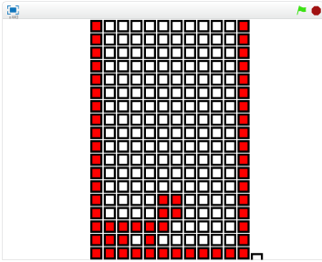

# テトリスの作り方 now creating

テトリスは落ち物パズルゲームの元祖です。ソビエト社会主義共和国連邦科学アカデミーで働いでいた科学者アレクセイ・パジトノフによって作成されました。

テトリスは通常のプログラム言語的な処理で書くと素直にかけるのですが、Scratchで書くのはかなり大変です。

本書での最難関のプログラミングとなります。気長にトライしてみてください。

#### TETRIS

テトリスは上からTetriminoという、四つの四角形の組み合わさったブロックが上から降ってくるゲームです。

この、テトロミノを横方向に隙間なく並べると、ブロックを消すことができ、同時に消した面積が大きいほど高得点を得ることができるゲームです。

#### Scratchで再現してみよう

https://scratch.mit.edu/projects/79439640/

左キーを押すと、Tetriminoが左に移動します。
右キーを押すと、Tetriminoが右に移動します。
下キーを押すと、Tetriminoが下に移動します。
Spaceキーを押すと、Tetriminoが回転します。

#### REF

https://ja.wikipedia.org/wiki/%E3%83%86%E3%83%88%E3%83%AA%E3%82%B9

https://en.wikipedia.org/wiki/Tetris
