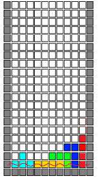
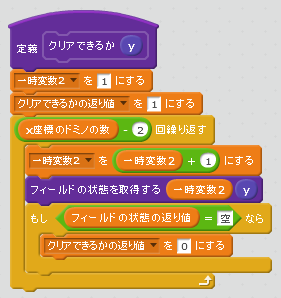
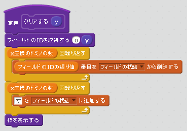
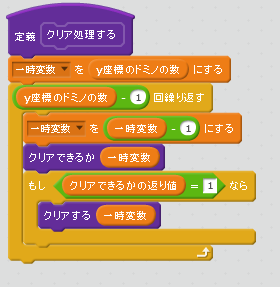
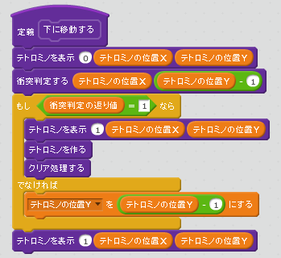
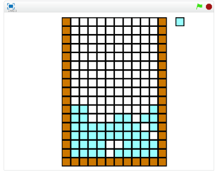

# クリアする

https://scratch.mit.edu/projects/84217246/

列が揃ったからプロックが消えます。この機能を追加しましょう。

### (1) 指定した列がクリアできるか確認

### (2) 指定した列をクリアする

### (3) すべての列がクリアできるか確認する

### (4) 新たにテトロミノを作成するタイミングでプロックをクリアする

### (5) 確認する

###### (5-1) 右上(みぎうえ)の緑色(みどりいろ)の旗(はた)をクリックする。

###### (5-2) ドミノがそろうと、クリアされること
