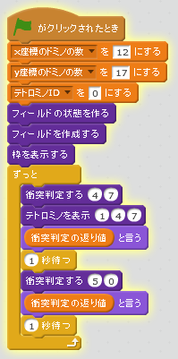

# テトロミノの衝突判定を追加する。

https://scratch.mit.edu/projects/84080228/

テトロミノの衝突判定機能を作りましょう。

### (1) 衝突判定のスクリプト

### (2) 確認する

https://scratch.mit.edu/projects/84080228/

##### (2-1) スクリプトを追加する

##### (2-2) 右上(みぎうえ)の緑色(みどりいろ)の旗(はた)をクリックする。

##### (2-3) 1 と 0が交互に表示されること

