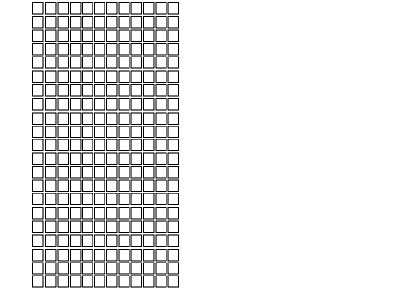
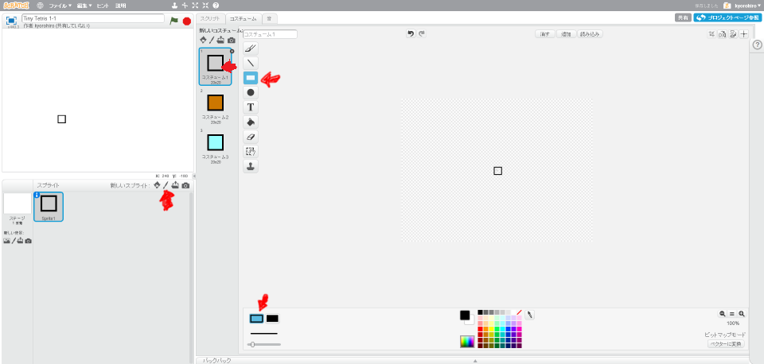
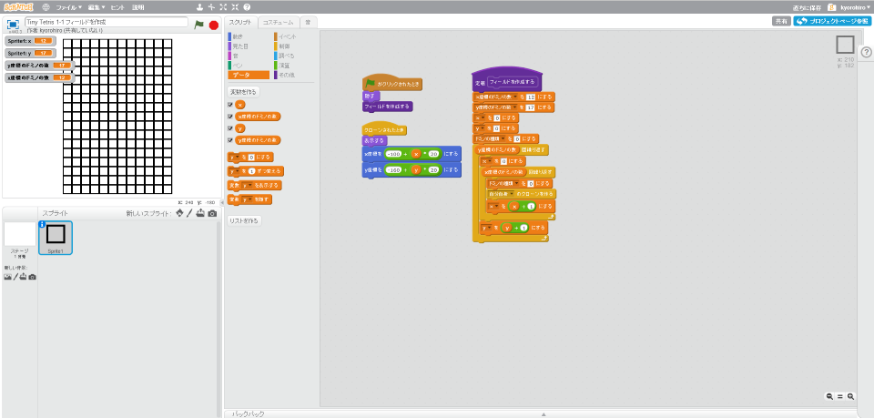
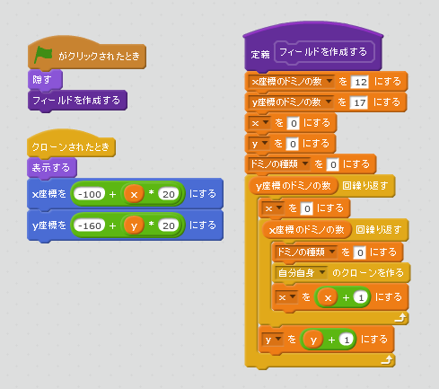

# フィールドを作成する

https://scratch.mit.edu/projects/79809006/

ゲーム画面を作成します。テトリスのゲームフィールドは四角形の集まりです。
まずは、このフィールドを作成してみましょう。

#### [1] 小さな四角形を中央に描く

このチュートリアルでは、三色の四角形を利用します。

##### [1-1] 左下のペンマークを選択する
##### [1-2] 中央に四角形を書く
##### [1-3] 複製を作成する
###### [1-3-1] 中央のコスチューム1にマウスカーソルを合わせる
###### [1-3-2] 右クリックする
###### [1-3-3] 複製を選ぶ
###### [1-3-4] 色を変える

#### [2] スクリプトを追加する

