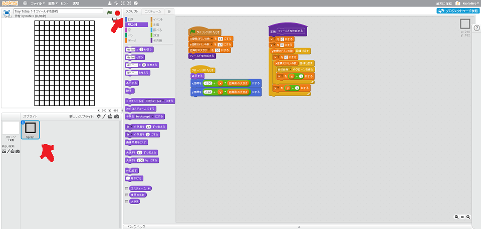

# フィールドを作成する

https://scratch.mit.edu/projects/79809006/

ゲーム画面を作成します。テトリスのゲームフィールドは四角形の集まりです。
まずは、このフィールドを作成してみましょう。

#### (1) 小さな四角形を中央に描く

このチュートリアルでは、三色の四角形を利用します。
* 枠が表示される場合
* テトロミノが存在する場合
* 何も存在しない場合

##### (1-1) 左下のペンマークを選択する
##### (1-2) 中央に四角形を書く
##### (1-3) 複製を作成する
###### (1-3-1) 中央のコスチューム1にマウスカーソルを合わせる
###### (1-3-2) 右クリックする
###### (1-3-3) 複製を選ぶ
###### (1-3-4) 色を変える
##### (1-4) 複製を作成する
###### (1-4-1] 中央のコスチューム1にマウスカーソルを合わせる
###### (1-4-2] 右クリックする
###### (1-4-3] 複製を選ぶ
###### (1-4-4] 色を変える

 
 
 

#### (2] スクリプトを追加する
この四角形を

##### (2-1] スクリプトタブをクリックする。
##### (2-2] 以下のスクリプトを追加する

※ 「四角形の大きさ」と、「y座標のドミノの数」は描いた四角形の大きさによって事なります。画面内にきれいに表示できるように調整してください。

※ ブロックを作成するときは、「画面を再描画せずに実行する」にチェックを入れる。

※  変数を作るときは、"x"と"y" のみ、「このスプライトのみ」にチェックを入れること

## (3)確認してみよう

https://scratch.mit.edu/projects/79809006/

###### (3-1) 右上(みぎうえ)の緑色(みどりいろ)の旗(はた)をクリックする。

###### (3-2) フィールドが表示されれば成功です。ドミノの色は気にしなくても良いです。

