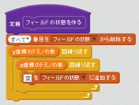
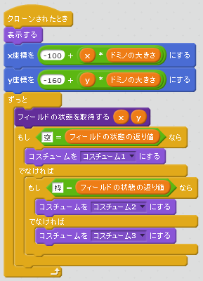

# フィールドの状態を記述する

https://scratch.mit.edu/projects/83255528

作成したでフィールドの四角形に色を塗れるようにします。

まずは、作成フィールドに番号を番号をふります。

### (1) Listにフィールドの状態を記録する

「フィールドの状態リスト」を作りに、降った番号に「枠あり」、「空」、「それ以外」の値を指定できるようにします。

ここでは、「空」を指定しています。

### (2) Listから値を取得する
フィールドの状態をXY座標を指定して設定できるようにします。

### (3) 記録した状態に応じて、色を変える。

### (4) 確認する

https://scratch.mit.edu/projects/83255528

