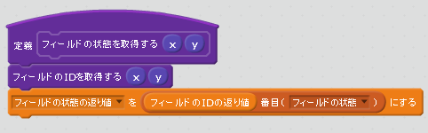
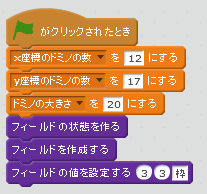

# フィールドの状態を記述する

https://scratch.mit.edu/projects/83255528

作成したでフィールド上の指定した四角形に色を塗れるようにします。

作成フィールドに番号を降って指定した四角形に状態を指定できるようにします。

### Listにフィールドの状態を記録する

### Listから値を取得する

### 記録した状態に応じて、色を変える。

### 確認する

