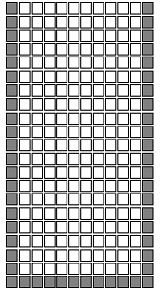
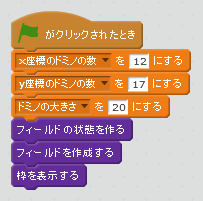
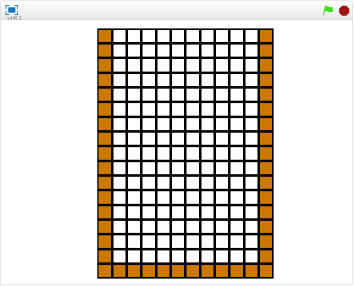

# 枠を追加する

https://scratch.mit.edu/projects/83795354/

何もないフィールドは味気がないので、次は枠を表示してみましょう。

#### (1) 枠を追加するスクリプト

#### (2) 枠を書いてみる

#### (3) 確認してみる

https://scratch.mit.edu/projects/83795354/

###### (3-1) 右上(みぎうえ)の緑色(みどりいろ)の旗(はた)をクリックする。

###### (3-2) フィールドに枠が表示されれば成功です

