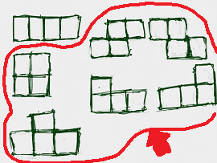
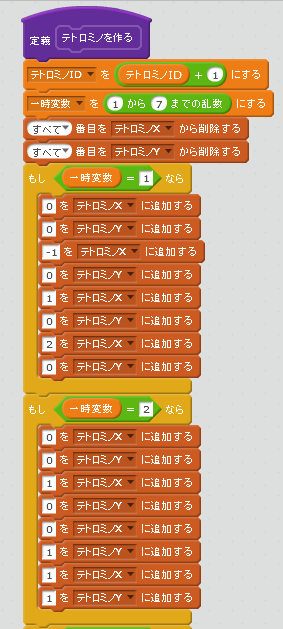
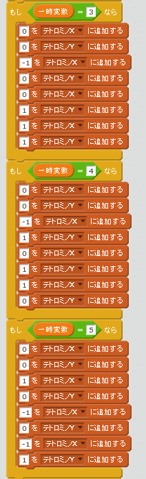
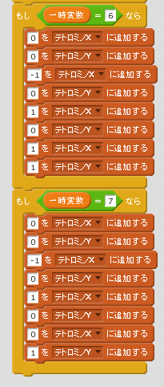
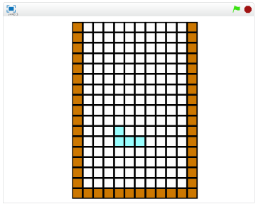

# テトロミノの数を増やす

https://scratch.mit.edu/projects/84070026/

他の6個のテトロミノを表示してみましょう。

### (1) スクリプトを追加

### (2) 確認する

###### (2-1) 右上(みぎうえ)の緑色(みどりいろ)の旗(はた)をクリックする。

###### (2-2) フィールドに七つのテトロミノが表示されればOKです。

