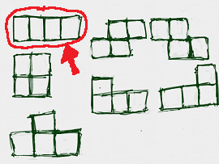
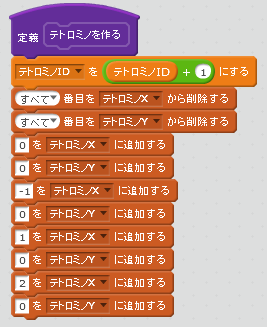
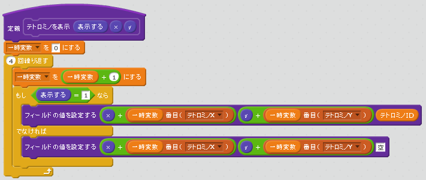
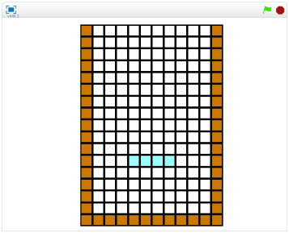

# テトロミノを表示する

https://scratch.mit.edu/projects/83259480/

次は、テトロミノを表示してみよう。　テトロミノは7種類あります。
今回はテトリスを表示してみたいと思います。

### テトロミノを表示する

### 確認する
https://scratch.mit.edu/projects/83259480/

###### (3-1) 右上(みぎうえ)の緑色(みどりいろ)の旗(はた)をクリックする。

###### (3-2) フィールドにテトリスブロックが表示されていれば成功です

