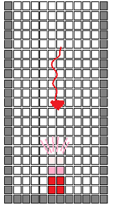
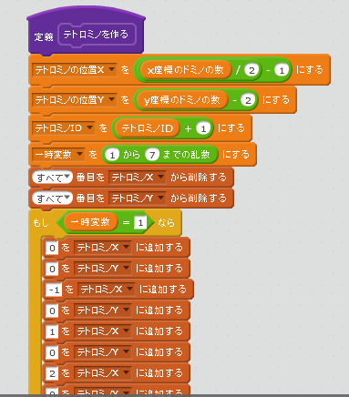
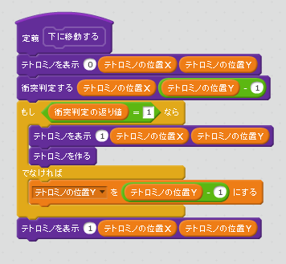
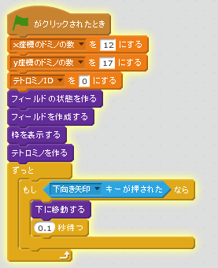
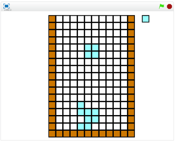

# 下に移動する

https://scratch.mit.edu/projects/84190998/

### Script

### 確認する

###### (3-1) 右上(みぎうえ)の緑色(みどりいろ)の旗(はた)をクリックする。

###### (3-2) 下キーを押すとテトロミノが下に移動すること
###### (3-3) テトロミノがブロックに触れると、新たなブロックが上から降ってくること

