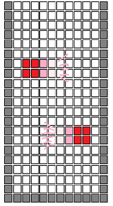
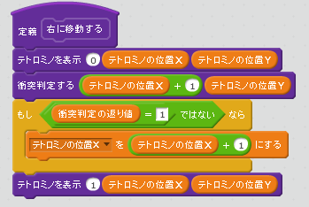
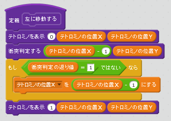
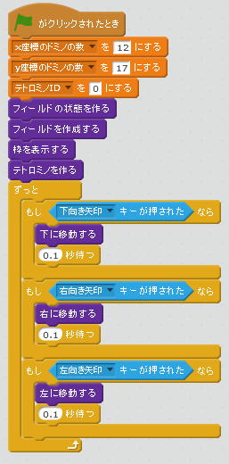
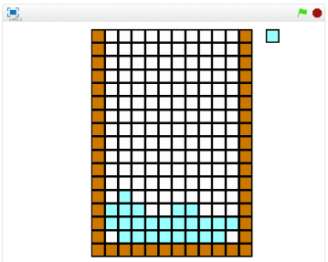

# 左右に移動する

https://scratch.mit.edu/projects/84206260/

次は左右に移動する機能を追加してみましょう。

### スクリプトを書く

### 確認する

###### (3-1) 右上(みぎうえ)の緑色(みどりいろ)の旗(はた)をクリックする。

###### (3-2) 左キーを押すとテトロミノが左に移動すること
###### (3-3) 右キーを押すとテトロミノが右に移動すること

