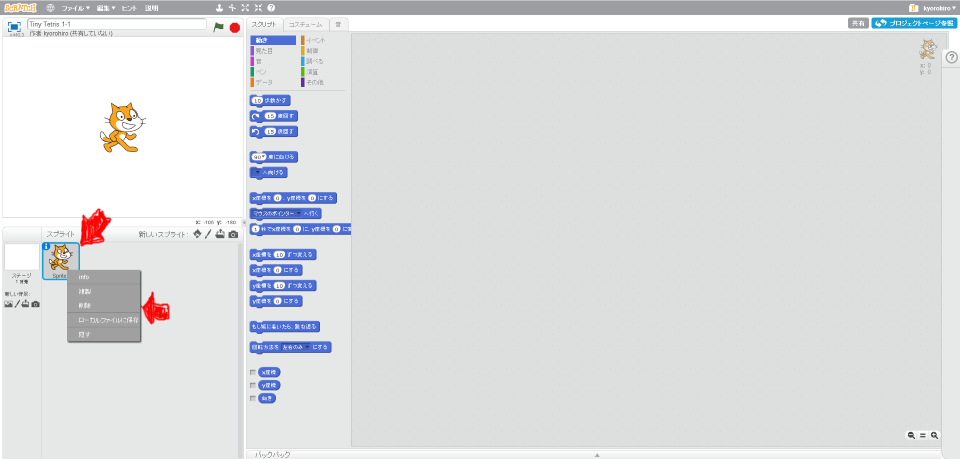

# Sprite1 を削除(さくじょ)する

#### (1) Sprite1 を削除(さくじょ)する
猫(ねこ)のSprite(スプライト)は使(つか)わないので削除(さくじょ)しましょう。 

##### (1-1) Sprite1の上(うえ)にマウスカーソルを合(あ)わせる

##### (1-2) 右(みぎ)クリックする

##### (1-3) メニューから削除(さくじょ)を選(えら)ぶ