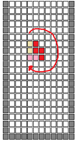
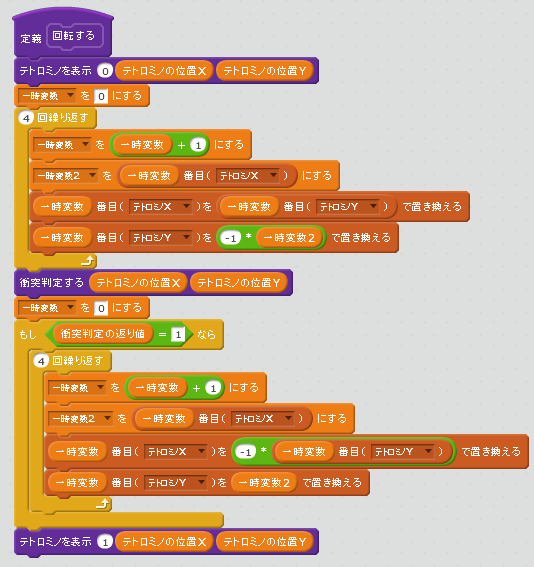
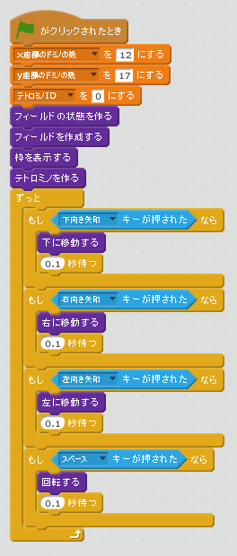
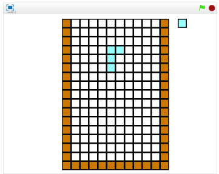

# テトロミノを回転させる

https://scratch.mit.edu/projects/84211804/

次はテトロミノを回転させてみましょう。もしも回転後に衝突するようならば、回転は失敗します。

### スクリプトを書く

### 確認する

###### (3-1) 右上(みぎうえ)の緑色(みどりいろ)の旗(はた)をクリックする。

###### (3-2) Spaceキーを押すとテトロミノが回転すること

